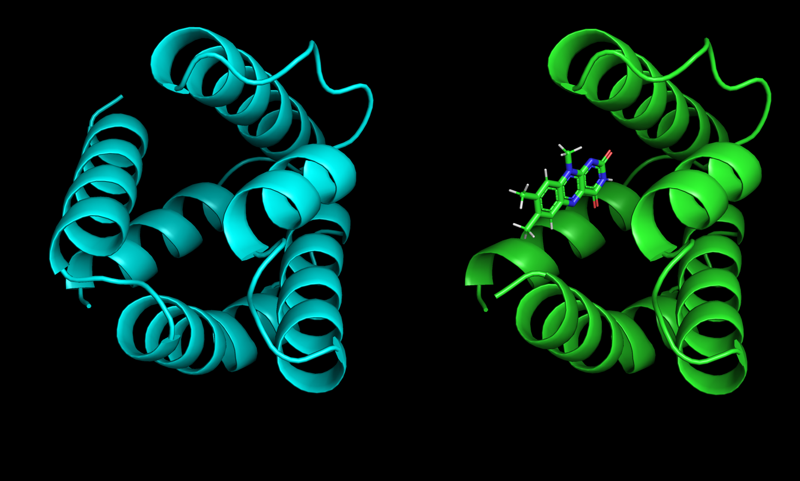

# Introduction of Binding Sites in Deltaprot Scaffolds using RASSCCoL

## Project Goal

-   **Objective:** Repurpose inert Deltaprots for photocatalytic activity.
-   **Target Ligand:** Mandelate & Lumiflavin (LMF)
-   **Scaffolds:** 30 parametrically designed Deltaprots

## Proposed Methodology

  
   
  <em>The process of removing a helix from a Deltaprot, then binding a ligand (in this case LMF)</em>

1. **CREATE INCOMPLETE DELTAPROTS:** To make room for an active site, we need to remove an alpha-helix from each Deltaprot. We have a few options here - we can remove either the N-terminal or C-terminal helix, we also need to decide on how much loop region we want to keep. As there are only 30 of these scaffolds, it might be quicker to do this in Pymol rather than faffing around with a python script. 

> We probably want to work out a systematic way of naming these incomplete Deltaprots so that we can refer to them later

2. **RUN RASSCCoL:** Once we have our incomplete Deltaprots, we can run RASSCCoL on them. We should probably work on binding LMF first, then Mandelate. 

## Key Challenges

- **Avoiding Rabbit Holes:** There are a lot of parameters to explore when creating an incomplete Deltaprot. It might be tempting to systematically explore all of these, bit this will cause a combinatorial explosion very quickly. For this hackathon, we should focus on getting some structures that look reasonable, then move on. `Tadas` can do the systematic exploration once he has published his first Deltaprot paper!

- **Adaptin RASSCCoL for Deltaprots:** The hope is that RASSCCoL will work for Deltaprots "out-of-the-box". However, the active site of incomplete Deltaprots are going to be semi-solvent exposed. This could interact with the volume-based culling step in RASSCCoL. My guess is that we can find a hacky scaling factor to make this work. If we can think of anything more clever or sophisticated, that would be better!