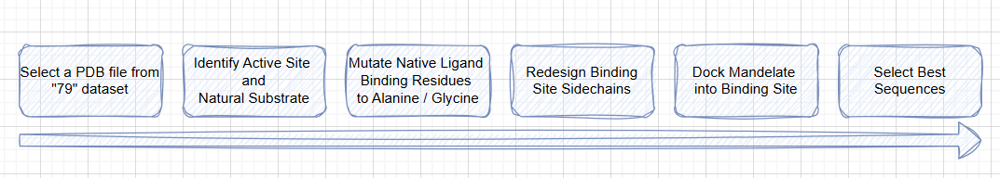

# Active Site Redesign of Potentially Photoactive Flavoproteins

## Project Goals

-   **Objective:** Introduce a mandelate binding site near the native flavin cofactor.
-   **Target Ligand:** Mandelate
-   **Scaffolds:** Proteins from the "Flavin 79" Dataset that Harry & Junfeng have shown to have higher fluorescence than cvFAP itself.

## Proposed Methodology

Here is an outline of the proposed workflow, feel free to get creative and come up with your own ideas!

  
   
  <em>A workflow for redesigning the active site of a naturally photoactive flavoprotein to bind a new ligand</em>

1. **SELECT A SCAFFOLD:** From our "Flavin 79" Dataset, Harry and Junfeng have identified several (~7) proteins that have a higher fluorescence than cvFAP itself. Each team member should select one of these promising candidates to work on

2. **IDENTIFY ACTIVE SITES:** The proteins in this dataset are natural. Before we start redesigning them, it is probably a good idea to work out what their natural function is. This will also  help us to choose binding the intened binding site for madelate.

3. **KNOCK-OUT NATIVE BINDING RESIDUES:** With our Wild-Type protein, the active site is presumably adapted to bind it's natural substrate. If dock mandelate into Wild-Type proteins, the poses generated will be biased by the WT active site sidechains.
We could mutate a few of the larger active site residues to something smaller (Ala or Gly) to remove this bias. 

4. **DOCK MANDELATE:** Dock Mandelate into the active site of your protein. If you have a natural substrate, you might want to use it's location in the crystal structure as a guide. If you get multiple plausible binding poses, it may be a good idea to proceed with a few of them in the following steps

> NOTE: instead of doing the previous two steps, you could manually / systematically place the ligand in the active site. This method would completely ignore the side-chains of the WT active site. 

5. **REDESIGN BINDING SITE SIDE-CHAINS:** Now that you have some Protein-Mandelate complexes, you can redesign the sequence to better accomodate Mandelate. For this type of redesign task, we don't want to completely redesign the entire sequence. Instead, rationally pick some "hotspots" to redesign and restrain the AI tool to predict residues for these positions only.

6. **SELECT BEST SEQUENCES:** AI methods generate a probability distribution of amino acid identities at each "hotspot" position. We can sample from these distributions to generate final sequences. Depending on how we do this sampling, this can produce a huge library of potential sequences. Out of this large library, we need to narrow down the best candidates. As this task will be relevant to each project, I will discuss it in its own section. 

## Key Challenges

- **Getting a Decent Binding Pose:** This is an ongoing discussion in our lab: If we leave Wild-Type residues in the active site prior to docking, we bias the docking poses. This in turn will introduce a bias in the sequences produced by the AI tools. Conversely, by mutating the active site residues to smaller residues we can remove *this* bias, but then introduce a new one. 

